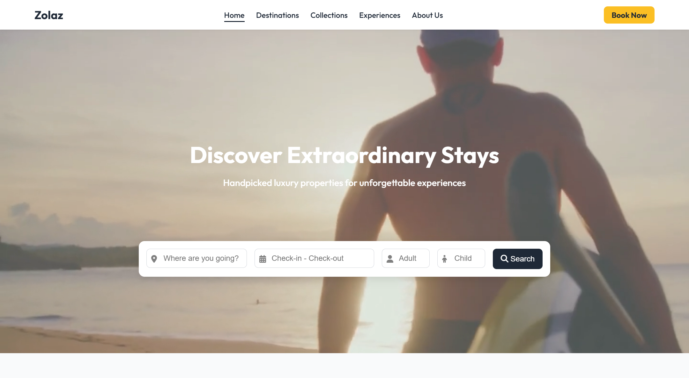
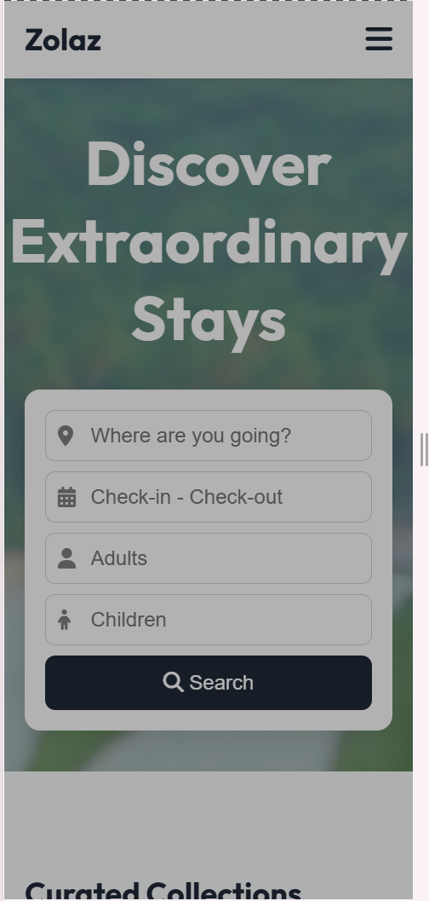

🏝️ Zolaz - Booking Home page Website
Zolaz is a modern, responsive luxury  homepage designed using HTML, CSS, and JavaScript. It offers a sleek interface with interactive elements like a hamburger menu, video background, curated property listings, and a newsletter subscription form. Perfect for showcasing premium travel experiences.

✨ Features
✅ Responsive navigation bar with a hamburger toggle (includes close X icon).

✅ Hero section with full-screen video background.

✅ Interactive search bar with:

Location input

Date picker (via Litepicker)

Adults and Children input

✅ Curated Collections and Popular Destinations.

✅ Informative sections: Features, Newsletter, and Footer.

✅ Font Awesome icons and Google Fonts.

✅ Optimized mobile and desktop design.

📁 Project Structure
bash
Copy
Edit
Booking/
│
├── Assest/
│   ├── css/
│   │   └── index.css              # Main stylesheet
│   ├── Images/
│   │   ├── ZOLAZ.webp             # Favicon
│   │   ├── video.mp4              # Hero background video
│   │   ├── *.webp / *.jpeg        # Property & UI images
│   │   └── *.svg                  # Feature section icons
│
├── index.html                     # Main homepage
└── README.md                      # Project documentation
🛠️ Tech Stack
HTML5 – Semantic markup

CSS3 – Custom responsive styling

JavaScript – Interactivity

Litepicker – Date range picker

Font Awesome – Icon library

Google Fonts – "Outfit" typeface

📱 Mobile Responsiveness
Hamburger menu toggles on small screens.

Navigation and booking button are integrated into the mobile nav panel.

Hero, cards, and footer sections scale appropriately for all device sizes.

🚀 How to Use
Clone or download the repository.

Ensure the folder structure is intact.

Open index.html in any browser.

Test responsiveness by resizing the browser or using mobile dev tools.

🔧 To Do / Improvements
Integrate backend for booking and newsletter form.

Add more destination cards dynamically from a CMS or JSON.

Include loading animations or transitions.

Improve accessibility and SEO metadata.

🖼️ Screenshots

📌 Credits
Font Awesome – Icons library

Litepicker – Lightweight date picker

Unsplash / Freepik – Image sources

📃 License
This is a frontend-only project created for personal or portfolio use. You are free to modify it. Attribution appreciated if published.
